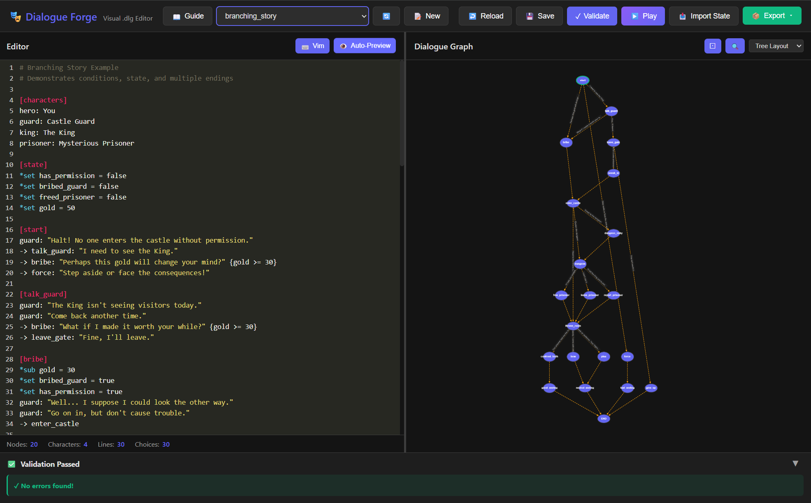

# Dialogue Forge

A dialogue scripting system and visual editor for game developers. Write branching dialogues in a simple `.dlg` format and preview them in an interactive web editor.



## Features

- **Simple `.dlg` format** - Human-readable dialogue scripting with characters, choices, conditions, and commands
- **Visual web editor** - Graph-based visualization of dialogue flow with live preview
- **Interactive playback** - Test your dialogues directly in the editor
- **Game state management** - Track variables, inventory, and companions
- **JSON export** - Export to JSON for easy integration with any game engine
- **Validation** - Catch errors before runtime with detailed error messages

## Installation

Requires Python 3.11+ and [uv](https://docs.astral.sh/uv/).

```bash
# Clone the repo
git clone https://github.com/yourusername/dialogue-forge.git
cd dialogue-forge

# Install dependencies
uv sync
```

## Quick Start

```bash
# Launch the visual web editor
uv run dlg-web

# Validate a dialogue file
uv run dlg-validate path/to/dialogue.dlg

# Test dialogue in terminal
uv run dlg-play path/to/dialogue.dlg

# Export to JSON
uv run dlg-export path/to/dialogue.dlg
```

## DLG Format

```dlg
# A simple dialogue example
[characters]
hero: Player
npc: Village Elder

[state]
*set talked_before = false
*set reputation = 0

[start]
npc: "Welcome, traveler!"
-> greet: "Hello there!"
-> rude: "Out of my way." {reputation < 0}
-> END: "Goodbye."

[greet]
*set talked_before = true
*add reputation = 5
npc: "Nice to meet you! How can I help?"
-> END
```

### Key Syntax

| Element | Syntax | Example |
|---------|--------|---------|
| Character | `id: Display Name` | `hero: Player` |
| Node | `[node_name]` | `[start]` |
| Dialogue | `speaker: "text"` | `npc: "Hello!"` |
| Choice | `-> target: "text"` | `-> shop: "Show me your wares"` |
| GOTO | `-> target` | `-> fallback` (auto-transition) |
| Conditional GOTO | `-> target {cond}` | `-> secret {has_key}` |
| Condition | `{expression}` | `{gold >= 50}` |
| Command | `*command` | `*set flag = true` |

### Commands

- `*set var = value` - Set a variable
- `*add var = num` - Add to a numeric variable
- `*sub var = num` - Subtract from a variable
- `*give_item name` - Add item to inventory
- `*remove_item name` - Remove item from inventory
- `*add_companion name` - Add a companion
- `*remove_companion name` - Remove a companion

### Conditions

- `{variable}` - Check if truthy
- `{!variable}` - Check if falsy
- `{var > 5}` - Numeric comparison (`>`, `<`, `>=`, `<=`, `==`, `!=`)
- `{has_item:sword}` - Check inventory
- `{companion:guide}` - Check companions
- `{a && b}` - AND condition
- `{a || b}` - OR condition

## Web Editor

The web editor provides:

- **Split view** - Code editor on the left, visual graph on the right
- **Live preview** - See graph updates as you type
- **Interactive playback** - Test dialogues with state tracking
- **State management** - View, edit, and import/export game state
- **Node navigation** - Right-click nodes to edit or play from that point

## Integration

Export your dialogues to JSON for use in any game engine:

```bash
uv run dlg-export my_dialogue.dlg
```

This creates `my_dialogue.json` with a structure ready for your dialogue system.

## License

MIT License - see [LICENSE](LICENSE) for details.
